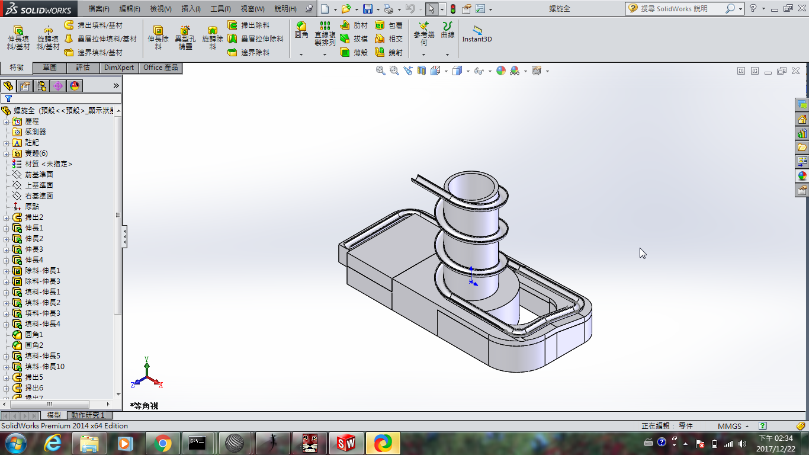
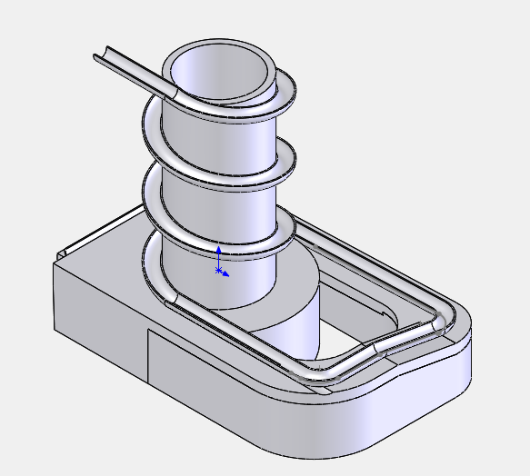

Title: 2017 Fall CADP 第十六週  小組分工(二)
Date: 2017-12-29 13:20
Category: Course
Tags: 2017fall, CADP, Solvespace, V-rep
Author: 40023139

小組分工(二)

<!-- PELICAN_END_SUMMARY -->

<a href="https://github.com/40023139/40023139_finalproject">個人倉儲倉儲</a>

<a href="https://github.com/s40523210/bg1_cadp_finalproject">第一組協同倉儲</a>

<a href="https://cad.onshape.com/documents/08e7fc9f43d856d66ff5a661/w/6e8d0674c911f1123dd3a26d/e/76e38414d220390a04095d03">Onshape上升機構協同倉儲</a>

本週進度

<h3>一、軌道主體設計</h3>

<h2>軌道主體</h2>

<iframe src="./../data/stlviewer/viewstl.html?src=./../project/STL/track.STL" width="800" height="600"></iframe>

<h2>軌道主體改良後</h2>

<h3>二、軌道模組 V-rep 模擬 </h3>

<iframe width="560" height="315" src="https://www.youtube.com/embed/WOKI-qp25FQ" frameborder="0" gesture="media" allow="encrypted-media" allowfullscreen></iframe>

<h3>三、驅動馬達程式撰寫</h3>

<h2>28BYJ-48 步進馬達</h2>

<pre class="brush: c">
#include &lt;Stepper.h&gt;
#define STEPS 2048

Stepper stepper(STEPS, 8, 10, 9, 11);

void setup()
{
stepper.setSpeed(5);     // 將馬達的速度設定成150RPM 最大  150~160
}

void loop()
{
Serial.begin(9600);
Serial.println("+0.5"); //透過序列視窗看到馬達現在轉角
stepper.step(2048);//正一圈
delay(1);
</pre>

<h3>四、曲柄滑塊上升機構</h3>

<h2>solvespace 運動簡圖模擬</h2>
<iframe width="560" height="315" src="https://www.youtube.com/embed/pZ_u1j2QTPM" frameborder="0" gesture="media" allow="encrypted-media" allowfullscreen></iframe>

<h2>Onshape繪製與模擬</h2>

<iframe width="560" height="315" src="https://www.youtube.com/embed/Rufa_Z-gLic" frameborder="0" gesture="media" allow="encrypted-media" allowfullscreen></iframe>

<h2>V-rep模擬</h2>

<iframe width="560" height="315" src="https://www.youtube.com/embed/3mNpb95haaA" frameborder="0" gesture="media" allow="encrypted-media" allowfullscreen></iframe>

<h2>出現問題整理</h2>

1.滑軌部分需要調整，再加入滑動對之前都能正常運轉，不會有接頭跳開的狀況
2.承上，滑塊的行程錯誤只有一半的距離

